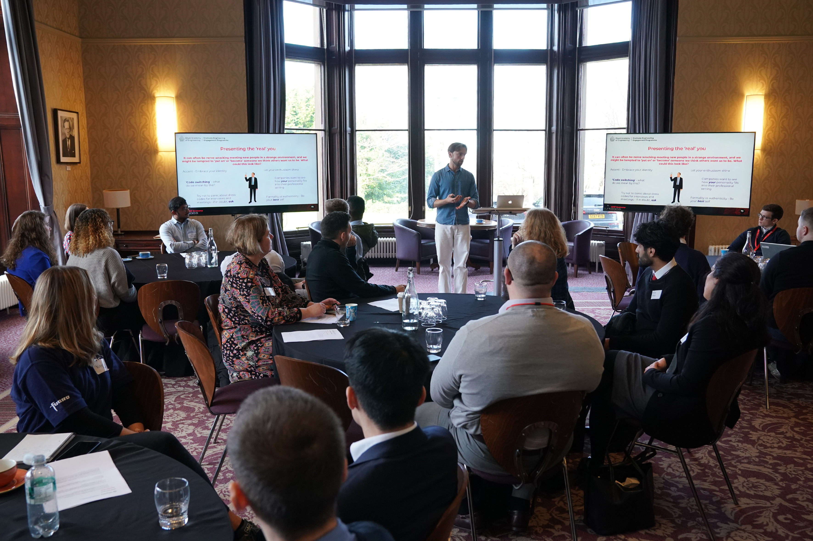
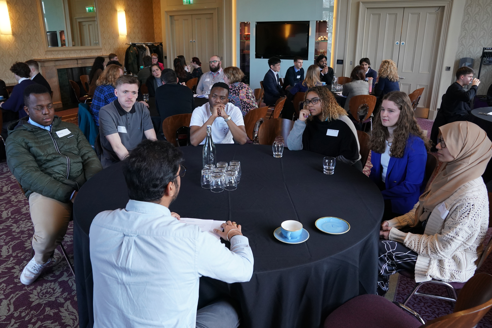
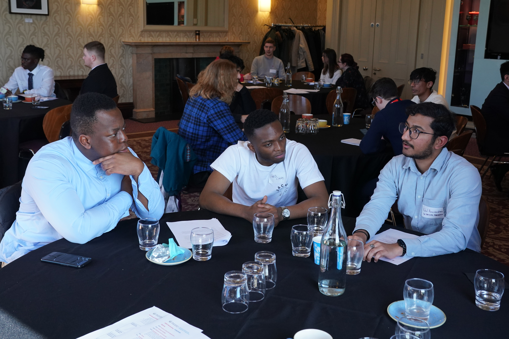
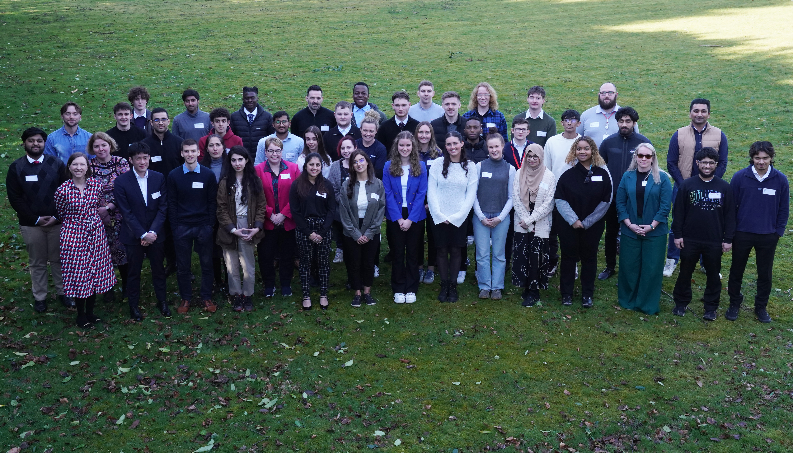



## About the GEEP programme 

The Graduate Engineering Engagement Programme (GEEP) is an award-winning initiative by the Royal Academy of Engineering designed to bridge the gap between higher education and the engineering industry. Launched to support UK engineering students and recent graduates from under-represented backgrounds, GEEP provides a structured programme that fosters collaboration between students and businesses, creating an environment where both can thrive. 

Over the past 10 years, GEEP has engaged more than 1,300 students from over 70 universities, leading to at least 320 employment opportunities, including internships, graduate placements, and jobs. Of the students involved in GEEP, 30% are women and over 90% are from Black, Asian and minority ethnic backgrounds.[^1]  

By focusing on diversity and inclusion, GEEP enriches the engineering sector with varied perspectives, driving innovation and excellence. The programme not only benefits students but also encourages engineering firms to access and attract emerging talent, thereby fostering a more inclusive and dynamic industry. 

GEEP focuses on building student confidence, demystifying the profession, creating networks and helping students navigate recruitment processes. The programme gives students access to the resources they need to fully explore the profession and gain valuable insights into top engineering firms, enabling them to make informed career choices. 

Bootcamps are a multi-partner, all day event which aim to best prepare GEEP candidates for a variety of career applications, through providing them with practical experiences of recruitment processes as well as the opportunity to meet and network with potential future employers.  

The day consists of a series of workshops covering the whole breadth of the recruitment process including applications, CVs, interviews and assessments. As well as learning key skills, candidates will put into practice what they’ve learned through mock interviews and team-based assessment centre challenges alongside industry volunteers. Bootcamps also provide a unique opportunity for candidates and partners to network with one another, where candidates can learn through both structured and informal networking about early career opportunities with our partner companies. 

For more information about the programme [visit the **programme page**](https://geep.raeng.org.uk/) 

## Why I Volunteered for the GEEP Bootcamp – And Why You Should Too! 

Volunteering for the Royal Academy of Engineering’s GEEP Bootcamp is a valuable opportunity that benefits both the programme and the volunteers themselves. The bootcamp is designed to support engineering students and graduates from underrepresented backgrounds, providing them with industry insights, networking opportunities, and professional skills that help bridge the gap between education and employment. Volunteers play a crucial role in making this initiative successful by offering mentorship, facilitating workshops, and sharing their career experiences. Their contributions ensure that participants receive personalized guidance, industry-relevant knowledge, and the confidence to navigate their career journeys. 

For volunteers, this experience is equally rewarding. It allows them to develop essential soft skills such as leadership, communication, and mentorship, all of which are highly valued in the engineering industry. Engaging with future engineers also expands a volunteer’s professional network, opening doors to collaborations and career growth. Additionally, contributing to a program that promotes diversity, and inclusion enhances a volunteer’s industry impact and reinforces their commitment to social responsibility. Ultimately, being part of the GEEP Bootcamp is a meaningful way to give back to the engineering community while simultaneously enriching one’s own career prospects. 

[^1]:[raeng GEEP page](https://raeng.org.uk/programmes-and-prizes/programmes/uk-grants-and-prizes/support-for-education/graduate-engineering-engagement-programme)